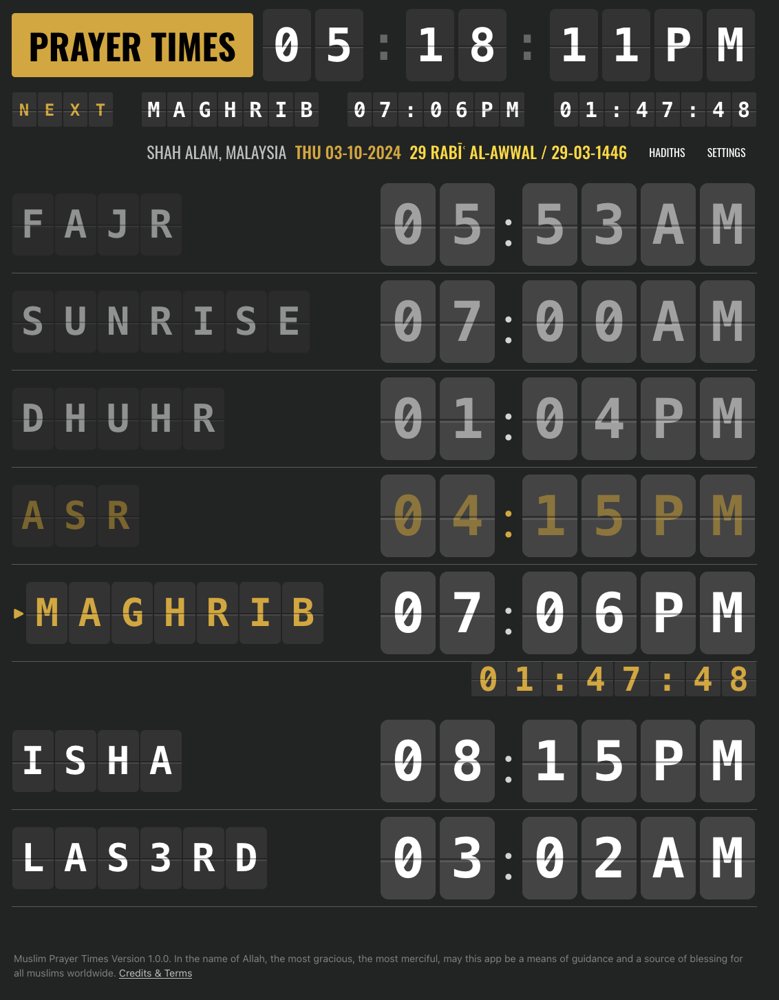

# Muslim prayer times

In the name of Allah, the most gracious, the most merciful, may this app be a means of guidance and a source of blessing for all muslims worldwide.

[Demo](https://azizazlan.github.io/adhan-ui)

## Features

Prayer times app displays:

- Prayer times for the day
- Countdown timer for the next prayer
- Hadith of the day

## Credits

To our brothers and sisters at AlAdhan and Hadith APIs, we are grateful to these services. Without them, this app would be hard to develop.

- [AlAdhan API](https://aladhan.com) - Used for Islamic prayer times and calendar information.
- [Hadith API](https://www.hadithapi.com/) - Used for accessing verified collections of hadiths.